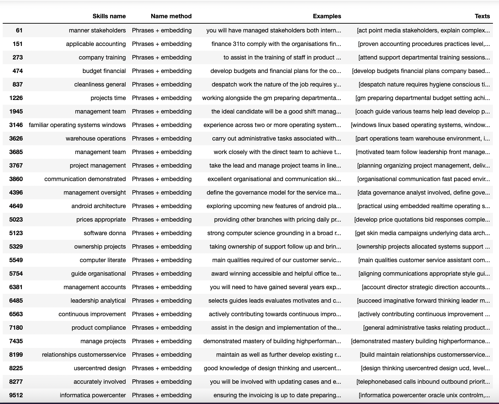
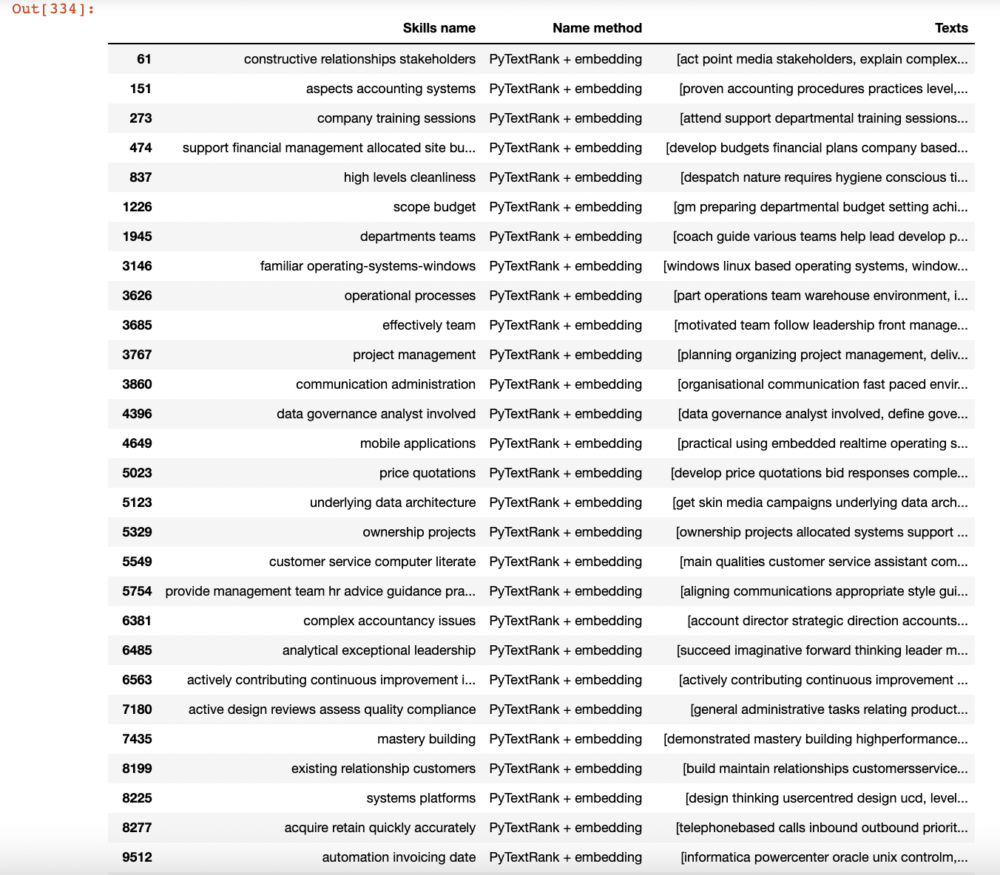
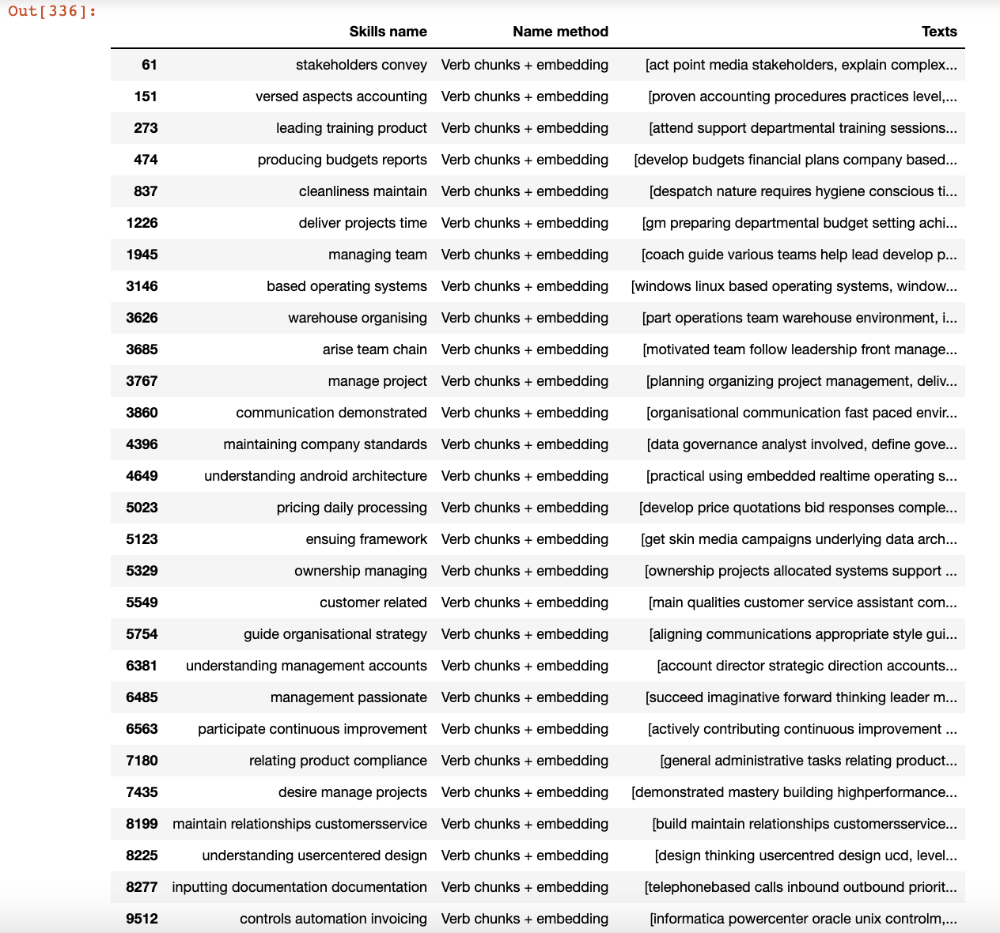

<!-- #region -->

# Naming skills 2.0

Functions to generate skill cluster names can be found in `skills_taxonomy_v2/pipeline/skills_extraction/skills_naming_utils.py`.

In an effort to improve skill cluster naming and to lower the probability of duplicate skill cluster label names, the initial approach was improved by:

1. More text cleaning - incl. getting rid of job specific language, singularising terms, getting rid of duplicate candidate ngram phrases i.e. 'day day'
2. Generating candidate ngrams _per_ cluster - candidate ngrams were generated using each cluster's available vocabulary, hopefully creating more 'local' skill labels. Minimum descriptions were also used as cluster labels in the event that candidate ngrams were not generated.
3. Merging skill clusters - if both the skill cluster name AND the cluster centroid were very close in semantic space, skills were merged together.

Experimentation with key phrase generation also took place.

## Key Phrase generation experiments

The 3 'key phrase' approaches are as follows:

1. Using Spacy's Phrases algorithm
2. Using TextRank network approach
3. Using Spacy's VERB chunking

Candidate ngrams were generated using the above methods per skill cluster. The cosine similarity of the generated candidate ngrams embeddings and the cluster centroid were then calcualed. The candidate ngram closest to the skill cluster centroid was then chosen as the skill cluster label.

See below the generated ngrams per 'key phrase approach' for a sample of k = 28 sentence clusters:

1. Phrases + embeddings

2. TextRank + embeddings

3. chunks + embeddings

All three approaches took a relatively similar amount of time to run on a data sample with k randomly sampled clusters, with the TextRank approach taking slightly longer. Qualitatively, it appears that the Phrases approach is the most semantically logical. The labels are also semantically similar to the TextRank approach.

## Merging skills

Skill clusters were merged based on both a) the proximity of skill cluster labels in semantic space AND 2) the proximity of the skill cluster centroids in semantic space. If the skill cluster label embeddings AND ALL skill cluster centroids were close, the skill clusters were subsequently merged. The new merged skill cluster name was generated by identifying the label embedding that was closest to the skill label centroid.

There needs to be some additional thinking on improving handling more than two skill cluster names that are close together in semantic space.

## Duplicate names

Hopefully, by generating candidate skill phrases per skill cluster AND merging skills that are similar both in label and in cluster centroid, the number of duplicate skill names decreases. In the event that there are identical skill cluster names, hopefully they sit in different parts of the skill hierarchy. More interrogation here is needed.
