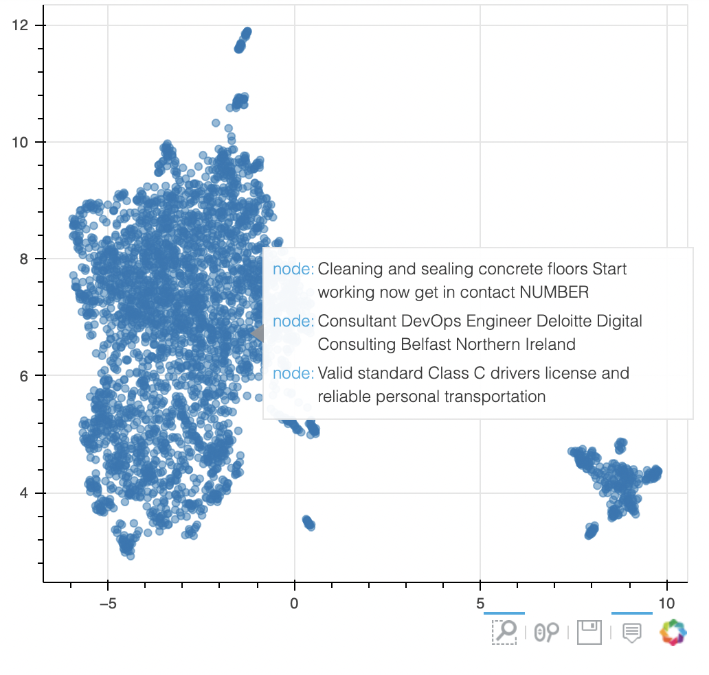
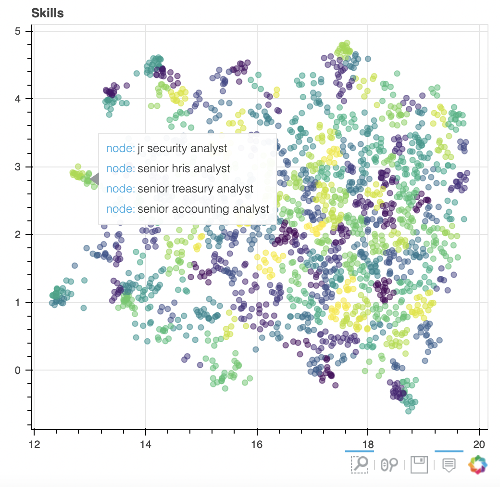
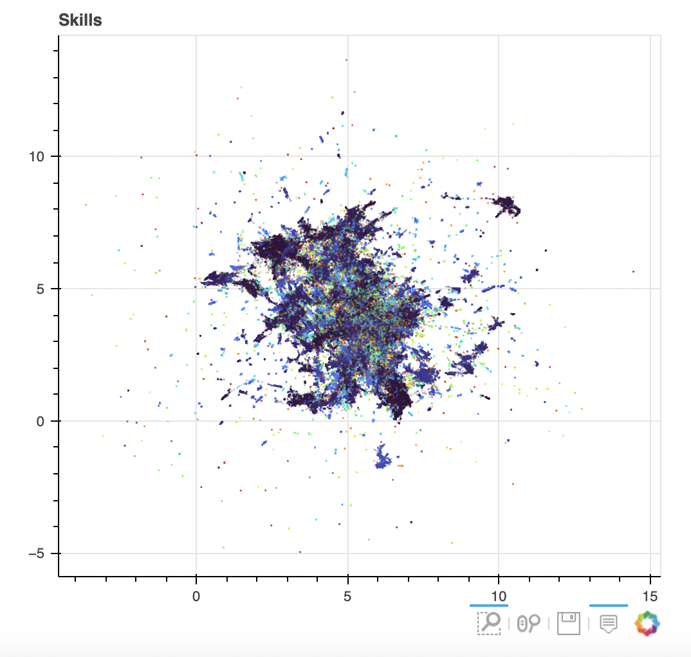
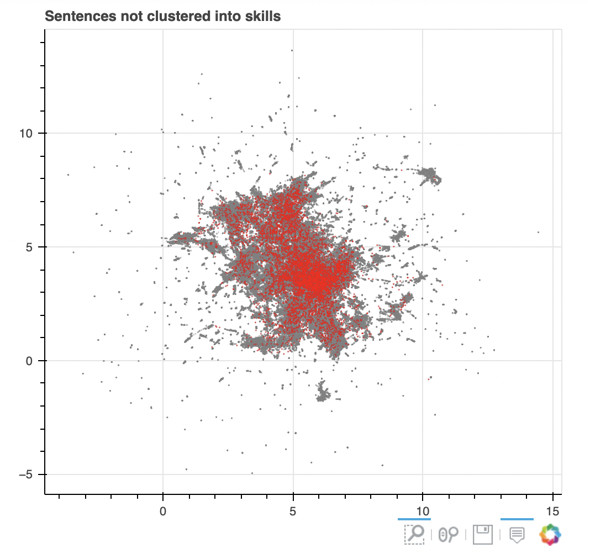

<!-- #region -->

# Extracting Skills

Functions to clean sentences to reduce them to the main words to do with skills can be found in `skills_taxonomy_v2/pipeline/skills_extraction/cleaning_sentences.py`.

Experimentation with 4 approaches is done in the relevant notebooks in `skills_taxonomy_v2/analysis/skills_extraction/notebooks/`:

1. Network approach
2. Transformers sentence embeddings approach - no masking
3. Word2vec approach
4. Transformers sentence embeddings approach - masking

## Network approach

In `Network approach.ipynb` we try to find skills using a network approach. In this, the skill sentences are cleaned and separated into words. A network is built on the co-occurence of words within the skill sentences. The hypothesis is that clusters of words frequently co-occuring should provide a proxy of a skill.

Communities in the pruned network (low TF-IDF words are removed) were found using the Louvain algorithm. 232 communities were found, the top 10 of these were (named by top 5 TF-IDF words):

```
 0: 'achieve-compliance-corre-discharge-coordination',
 1: 'look-commence-welcoming-visible-point',
 2: 'brand-mococomrmofni-employment-direct_report-please_get',
 3: 'awareness-ambitious-mileage-mate-car_driver',
 4: 'cost-reactive-college-peer-long_term',
 5: 'object-thorough-debtor-referencing-junkspam',
 6: 'administration-circa-preferred-excellent_communication-cpa',
 7: 'book-write_verbal-workflow-parent-outcome',
 8: 'a_positive-operation_manager-instructional-clearly-input',
 9: 'project_manager-senior-behavioral-bouw-overzeese',
 10: 'background-opportunity_grow-daily-flow-petty',
```

My thoughts on this approach were that the results weren't very encouraging and it felt like I was going back and forth with ideas for pruning the network - but never getting to a point where I thought the results looked any better.

Note: these results were only done on 6862 skill sentences, as this analysis was performed before scaling up the skill sentence predictions on more data.

## Transformers sentence embeddings approach - unmasked

In `Transformers sentence embeddings approach - unmasked.ipynb` I experimented with unmasked sentence embeddings and clustering to find skills. When we predicted the skill sentences we also outputted the sentence embeddings, so I thought it'd be good to see if these could be clustered.

Again, the results from this were very encouraging - I didn't even bother to cluster the 2D transformation into skills because I could tell in 2D space they didn't look very good. At this point I felt like there could be a bug somewhere, but also that it was likely that the non-skill words were effecting the sentence embedding.

Note: these results were only done on 6862 skill sentences, as this analysis was performed before scaling up the skill sentence predictions on more data.



## Word2vec approach

In `Word2vec approach.ipynb` I decided to use average word embeddings for a sentence to cluster skills by. In used the "word2vec-google-news-300" gensim word2vec model to find word embeddings for each word in a cleaned sentence. I reduced these to 2D using UMAP, and found clusters using K-means.

Note: these results were only done on 6862 skill sentences, as this analysis was performed before scaling up the skill sentence predictions on more data.



The top 5 TF-IDF words for 10 of the skill clusters were:

```
'ability-concision-persuasion-teamwork-circa',
 'driver-maintenance-carpentry-door-housing',
 'medium-plan-tool-stew-depend',
 'manager-administrative-cosmetic-tax-counter',
 'file-pdf-png-accepted-txt',
 'order-need-suit-payment-balance',
 'industry-knowledge-rail-environment-audit',
 'technician-dental-voltage-irrigation-biomedical',
 'agent-concierge-retail-prevention-salesperson',
 'coordinator-wellness-promotion-traffic-insight',
```

Although these results were a bit more encouraging, they still weren't great, so I decided to try out transformers based models again.

## Transformers sentence embeddings approach - masked

In `Transformers sentence embeddings approach - masked.ipynb` I experiment with using some masked sentence embeddings to extract skills from. In this approach the data is much bigger since we had processed more skill sentences by this point. The sentences were masked of various non-skill words (proper nouns etc) and then the data reduced via UMAP and clustered using DBSCAN. Some sentences had such a high proportion of words masked - so we got rid of these since their embeddings didn't have much signal in.

The clustering looked a lot more reasonable. There is probably a lot more scope at this point to play with the data reduction and clustering parameters, but at this point in the experimentation I opted to not spend too long on this.

- 4573 unique clusters
- Siloutte score: 0.13
- Proportion not clustered = 0.036





<!-- #endregion -->

```python

```
