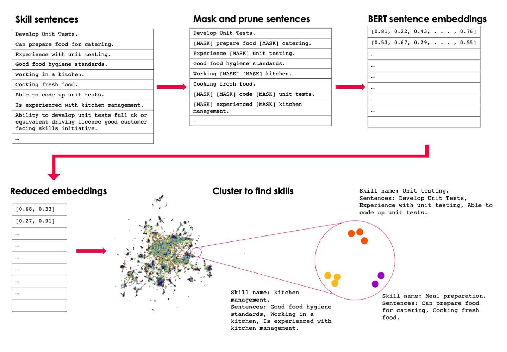

# Skills Extraction

The aim of this pipeline is to extract skills from job adverts. There are 4 steps:

1. Get embeddings from skill sentences (`get_sentence_embeddings.py`).
2. Reduce and cluster the embeddings - these are the skills (`extract_skills.py`).
3. Find names for each skill (`skills_naming.py`).
4. (Needs maintainence) Get an ESCO-TK skills index mapper (`esco_skills_mappings.py`).

The parameters for all these steps can be found in the config path `skills_taxonomy_v2/config/skills_extraction/2021.08.31.yaml`.



## `2021.08.31.yaml` summary

- Step 0: Predict skill sentences. 87 random files of 10,000 job adverts. Found around 4,000,000 skill sentences.
- Step 1: Get embeddings for each skill sentence. Get embeddings for sentences in the first 10,000 job adverts from each of the 87 files, remove sentences with only masking.
- Step 2: Get skills from clustering. Removed sentences with too much masking, remove repeated sentences, and only keep sentences within a certain length bound - 322,071 sentences. Reduce embeddings from 384 to 2 dimensions. Clustered into 18,894 skills, the proportion of data points not put into a cluster was 0.28. After removed sentences not clustered there are 232,394 sentences.

Finding skill names and ESCO links wasn't completed for this run.

Some preliminary analysis of the skills extraction steps (e.g. how many skills per job advert, common skills) can be found in `analysis/skills_extraction/notebooks/Skills Extraction Analysis and Figures.ipynb`.

## Step 1: Get embeddings for each skill sentence

Input : Skill sentences from TK job adverts.

Output : Embeddings for each sentence.

#### Details

In the previous step in the pipeline (Sentence Classifier) we extracted skill sentences from job adverts. With these we want to clean them (mask out proper nouns etc), and output embeddings for each of them.

This is done by running:

```
python -i skills_taxonomy_v2/pipeline/skills_extraction/get_sentence_embeddings.py --config_path 'skills_taxonomy_v2/config/skills_extraction/2021.08.31.yaml'
```

Outputs:

Outputs are stored within the `outputs/skills_extraction/word_embeddings/data/2021.08.31/` folder in the same folder structure as the skill sentences were saved in. For each file of job adverts two outputs are stored, one with the embeddings (ending in `_embeddings.json`) and one with the original sentences (ending in `_original_sentences.json`).

For example, the embeddings for the file of skill sentences in `outputs/sentence_classifier/data/skill_sentences/2021.08.16/textkernel-files/semiannual/2021/2021-04-01/jobs_new.5_2021.08.16.json` are stored in `outputs/skills_extraction/word_embeddings/data/2021.08.31/semiannual/2021/2021-04-01/jobs_new.5_2021.08.16_embeddings.json`

## Step 2: Extract skills using clustering

Input : Embeddings for each sentence.

Output : Which skill each sentence has been clustered into and its reduced embedding.

#### Details

- Remove data points where the sentence has too much masking
- Left with keywords for each sentence - assumption that these words are the essence of a skill, e.g. 'This was once a technical sentence about a engineering skill'-> 'technical engineering'
- UMAP embeddings reduction to 2D
- DBSCAN clustering of 2D reduced data
- Output sentences grouped into clusters - assumption that these are each a single skill. e.g. in once cluster 'technical engineering', 'software engineer'
- To examine the sample size of sentences used in clustering we also calculate the cumulative vocab size as more sentences are added.

This is done by running:

```
python -i skills_taxonomy_v2/pipeline/skills_extraction/extract_skills.py --config_path 'skills_taxonomy_v2/config/skills_extraction/2021.08.31.yaml'
```

Outputs:

- The sentences data including the embedding reduction and which cluster/skill the sentence was in - `outputs/skills_extraction/extracted_skills/2021.08.31_sentences_data.json`
- The centroids of each cluster `outputs/skills_extraction/extracted_skills/2021.08.31_cluster_centroids.json`
- The reducer class the created the 2D representation of the embeddings `outputs/skills_extraction/extracted_skills/2021.08.31_reducer_class.pkl`
- The cumulative vocabulary size with each sentence added `outputs/skills_extraction/extracted_skills/2021.08.31_num_sentences_and_vocab_size.json`
- A dictionary of sentence id to embeddings `outputs/skills_extraction/extracted_skills/2021.08.31_sentence_id_2_embedding_dict.json.gz`
    )

## Step 3: Get skills names

Input : The sentences clustered into skills and the embeddings for the sample of sentences used to create these.

Output : Skill names, key examples and cleaned texts for each skill.

#### Details

- Finds the skills name - The closest single ngram to the centroid of all the sentence embeddings which were clustered to create the skill using cosine similarity.
- Also finds the original sentences which are closest to the centroid of the skill cluster and all the cleaned sentences that went into creating the skill cluster.

This is done by running:

```
python -i skills_taxonomy_v2/pipeline/skills_extraction/skills_naming.py --config_path 'skills_taxonomy_v2/config/skills_extraction/2021.08.31.yaml'
```

Outputs:

- The skills data - `outputs/skills_extraction/extracted_skills/2021.08.31_skills_data.json`


## Step 4: Find ESCO mappings

Note: This code needs updating and doesn't currently work.

Input : ESCO skills and our bottom up skills

Output : A dictionary of how the two sets of skills can be mapped

This is done by running:

```
python -i skills_taxonomy_v2/pipeline/skills_extraction/esco_skills_mappings.py --config_path 'skills_taxonomy_v2/config/skills_extraction/2021.08.31.yaml'
```

Outputs:

- The ESCO ID to TK ID dictionary mapper - `s3://skills-taxonomy-v2 + outputs/skills_extraction/data/2021.08.02_esco2tk_mapper.json`
- The TK ID to ESCO ID dictionary mapper - `s3://skills-taxonomy-v2 + outputs/skills_extraction/data/2021.08.02_tk2esco_mapper.json`
- A dictionary of ESCO skills, this is because ESCO doesn't have a numerical unique identifier, so we save one out for use in linking back to traditional ESCO identifier - `s3://skills-taxonomy-v2/outputs/skills_extraction/data/2021.08.02_esco_ID2skill.json`
