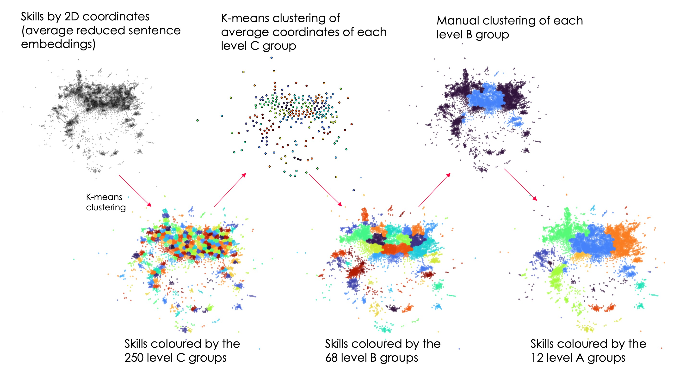

# Skills Taxonomy

The aim of this pipeline is to build the taxonomy from skills extracted from TextKernel job adverts. There are 2 steps:

1. Build the taxonomy (`build_taxonomy.py`)
2. Output a user friendly version of the taxonomy (`output_taxonomy.py`)

The parameters for all these steps can be found in the config path `skills_taxonomy_v2/config/skills_taxonomy/2021.09.06.yaml`.



## 1. Build the taxonomy

This is run by:
```
python -i skills_taxonomy_v2/pipeline/skills_taxonomy/build_taxonomy.py --config_path 'skills_taxonomy_v2/config/skills_taxonomy/2021.09.06.yaml'
```

Outputs:
- A dictionary of each skill with what part of the hierarchy it is in - `outputs/skills_taxonomy/2021.09.06_skills_hierarchy.json`
- A nested dictionary of each skill group with the skill groups it contains - `outputs/skills_taxonomy/2021.09.06_hierarchy_structure.json`

## 2. Output the taxonomy

Rather than output a json of the hierarchy with numerical keys, this switches the keys to the skill group names. It makes the json output a little bit more user-friendly as a means to interrogate the hierarchy.

Run by:
```
python -i skills_taxonomy_v2/pipeline/skills_taxonomy/output_taxonomy.py --config_path 'skills_taxonomy_v2/config/skills_taxonomy/2021.09.06.yaml'
```

Outputs:
- `outputs/skills_taxonomy/2021.09.06_hierarchy_structure_named.json`
